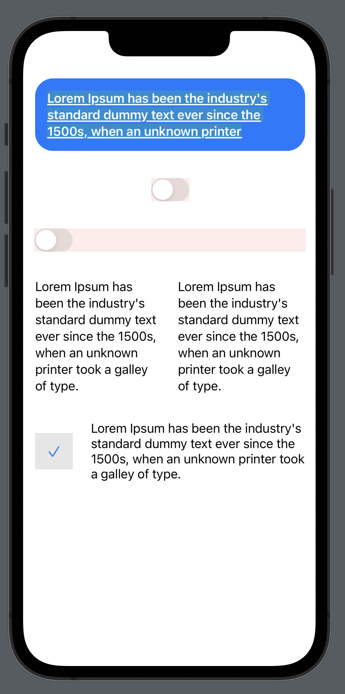

# UIKitView

## Documentation

https://ipedro.github.io/UIKitView/documentation/uikitview/

Sample usage:



```swift
var body: some View {
    ScrollView {
        VStack(spacing: 36) {
            UIKitView {
                UILabel()
            } then: {
                $0.adjustsFontForContentSizeCategory = true
                $0.numberOfLines = 0
                $0.attributedText = NSAttributedString(
                    string: "Lorem Ipsum has been the industry's standard dummy text ever since the 1500s, when an unknown printer",
                    attributes: [
                        .underlineStyle: NSNumber(value: 1),
                        .font: UIFont.preferredFont(forTextStyle: .headline),
                        .foregroundColor: UIColor.systemBackground,
                        .backgroundColor: UIColor.systemGreen.withAlphaComponent(0.25)
                    ]
                )
            }
            .padding()
            .background(Color.accentColor)
            .cornerRadius(24)
            
            UIKitView(traits: .fixedSize()) {
                UISwitch()
            } then: {
                $0.backgroundColor = .systemRed.withAlphaComponent(0.1)
            }
            
            
            UIKitView {
                UISwitch()
            } then: {
                $0.backgroundColor = .systemRed.withAlphaComponent(0.1)
            }
            
            HStack(spacing: 24) {
                // Body Text
                Text("Lorem Ipsum has been the industry's standard dummy text ever since the 1500s, when an unknown printer took a galley of type.")
                
                // Should look and behave exactly the same
                UIKitView {
                    UILabel()
                } then: {
                    $0.font = .preferredFont(forTextStyle: .body)
                    $0.adjustsFontForContentSizeCategory = true
                    $0.numberOfLines = 0
                    $0.text = "Lorem Ipsum has been the industry's standard dummy text ever since the 1500s, when an unknown printer took a galley of type."
                }
            }
            
            HStack(spacing: 24) {
                UIKitView(traits: .flexible(layoutPriority: .fittingSizeLevel)) {
                    UIImageView(image: .init(systemName: "checkmark"))
                } then: {
                    $0.contentMode = .scaleAspectFill
                }
                .padding()
                .background(Color.primary.opacity(0.1))
                .aspectRatio(contentMode: .fill)
                
                UIKitView {
                    UILabel()
                } then: {
                    $0.adjustsFontForContentSizeCategory = true
                    $0.numberOfLines = 0
                    $0.text = "Lorem Ipsum has been the industry's standard dummy text ever since the 1500s, when an unknown printer took a galley of type."
                }
            }
        }
        .padding()
    }
}
```
